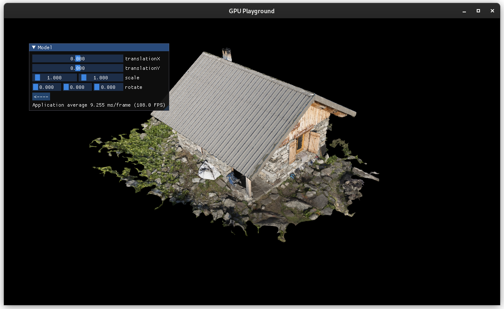
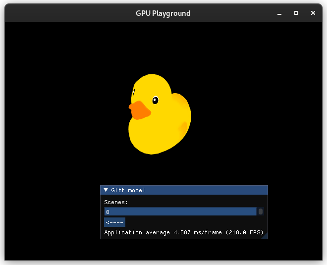
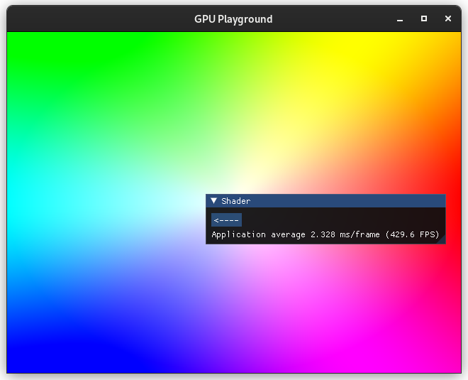

# Welcome to GPU Playground!

This project is a sandbox for experimenting with various rendering techniques using the Vulkan API. It's a place to freely explore and prototype ideas in Vulkan graphics programming.

## Building
As this project is a plain CMake project it can be built just like any other CMake project.
```bash
cmake -DCMAKE_BUILD_TYPE=Release -S <path-to-source> -B <path-to-build>
cmake --build <path-to-build> --target playground
```

## Preview






## Lisence

GPU Playground is licensed under the MIT License, see LICENSE for more information.
